# CLAUDE.md

## Changelog

**2026-04-19 17:26:20** - AI context initialization: Added comprehensive module structure diagram, module index, and detailed module-level documentation.

---

## Project Overview

LingoFlow is a lightweight desktop translator built with **Tauri 2 + React 19 + Rust**. Core features: selection translate, input translate, screenshot OCR, screenshot translate, and local HTTP API. The project supports macOS (V1 complete) and Windows (core features implemented, platform integration in progress).

## Module Structure

```mermaid
graph TD
    Root["LingoFlow (Root)"] --> Frontend["frontend/"];
    Root --> SrcTauri["src-tauri/"];
    Root --> Platform["platform/"];
    Root --> Scripts["scripts/"];
    
    Frontend --> FrontendSrc["src/"];
    FrontendSrc --> FeaturesDir["features/"];
    FrontendSrc --> InfraDir["infra/"];
    FrontendSrc --> AppDir["app/"];
    FrontendSrc --> TestsDir["tests/"];
    
    FeaturesDir --> OcrFeature["ocr/"];
    FeaturesDir --> SettingsFeature["settings/"];
    FeaturesDir --> TranslatorFeature["translator/"];
    FeaturesDir --> ScreenshotFeature["screenshot/"];
    FeaturesDir --> TaskFeature["task/"];
    FeaturesDir --> SelectionFeature["selection/"];
    FeaturesDir --> TrayFeature["tray/"];
    
    SrcTauri --> SrcTauriSrc["src/"];
    SrcTauriSrc --> CommandsModule["commands/"];
    SrcTauriSrc --> OrchestratorModule["orchestrator/"];
    SrcTauriSrc --> ProvidersModule["providers/"];
    SrcTauriSrc --> ApiProviderModule["apiprovider/"];
    SrcTauriSrc --> HttpApiModule["http_api/"];
    SrcTauriSrc --> StorageModule["storage/"];
    SrcTauriSrc --> PlatformModule["platform/"];
    SrcTauriSrc --> ErrorsModule["errors/"];
    
    Platform --> MacOSPlatform["macos/"];
    MacOSPlatform --> HelperModule["helper/"];
    
    click Frontend "./frontend/CLAUDE.md" "Frontend module documentation"
    click SrcTauri "./src-tauri/CLAUDE.md" "Rust backend documentation"
    click Platform "./platform/CLAUDE.md" "Platform bridge documentation"
    click CommandsModule "./src-tauri/src/commands/CLAUDE.md" "Tauri commands"
    click OrchestratorModule "./src-tauri/src/orchestrator/CLAUDE.md" "Task orchestration"
    click ProvidersModule "./src-tauri/src/providers/CLAUDE.md" "OCR providers"
    click ApiProviderModule "./src-tauri/src/apiprovider/CLAUDE.md" "Translation API clients"
    click HttpApiModule "./src-tauri/src/http_api/CLAUDE.md" "HTTP API server"
    click StorageModule "./src-tauri/src/storage/CLAUDE.md" "Config & keychain storage"
    click PlatformModule "./src-tauri/src/platform/CLAUDE.md" "Platform-specific capture"
    click ErrorsModule "./src-tauri/src/errors/CLAUDE.md" "Error handling"
    click HelperModule "./platform/macos/helper/CLAUDE.md" "macOS Swift helper"
```



## Module Index

| Module | Path | Language | Purpose |
|--------|------|----------|---------|
| **Frontend** | `frontend/` | TypeScript + React | UI layer: multi-window architecture, settings, OCR results, screenshot overlay |
| **Rust Backend** | `src-tauri/` | Rust | Core logic: Tauri app, commands, orchestration, providers, HTTP API |
| **Commands** | `src-tauri/src/commands/` | Rust | Tauri command handlers (translation, OCR, settings, shortcuts, debug) |
| **Orchestrator** | `src-tauri/src/orchestrator/` | Rust | Task orchestration: models, state machine, execution logic |
| **Providers** | `src-tauri/src/providers/` | Rust | OCR provider implementations (Apple Vision, OpenAI-compatible, Tesseract.js) |
| **API Provider** | `src-tauri/src/apiprovider/` | Rust | Translation API clients (Baidu, DeepL, Google, Microsoft, Tencent, Youdao) |
| **HTTP API** | `src-tauri/src/http_api/` | Rust | Local Axum HTTP server for external integrations |
| **Storage** | `src-tauri/src/storage/` | Rust | Config store (tauri-plugin-store) + keychain store (keyring) |
| **Platform** | `src-tauri/src/platform/` | Rust | Platform-specific capture (macOS via Swift helper, Windows native) |
| **Errors** | `src-tauri/src/errors/` | Rust | Unified error codes and AppError type |
| **macOS Helper** | `platform/macos/helper/` | Swift | Swift executable for macOS-specific features (capture, OCR, permissions) |
| **Scripts** | `scripts/` | JavaScript | Build and test automation scripts |

## Common Commands

```bash
# Development
npm run dev              # Start full Tauri app (frontend + Rust)
npm run dev:web          # Start frontend-only dev server (no Tauri)

# Build
npm run build            # Build full Tauri app
npm run build:frontend   # Build frontend only

# Quality checks
npm run check            # Run typecheck + lint + test (all)
npm run typecheck        # TypeScript type checking
npm run lint             # ESLint (frontend) + Clippy (Rust)
npm run format           # Prettier (frontend) + rustfmt (Rust)
npm run format:check     # Check formatting without writing

# Tests
npm run test             # Run all tests (frontend + Rust)
npm run test:frontend    # Vitest (frontend only)
npm run test:rust        # cargo test with 60s timeout
cd frontend && npx vitest run src/tests/features/shortcutMatcher.test.ts  # Single frontend test
cargo test --manifest-path src-tauri/Cargo.toml <test_name>               # Single Rust test
```

## Architecture

### Three-Layer Structure

```
frontend/          → React + TypeScript + Vite (UI layer)
src-tauri/         → Rust + Tauri 2 + Axum (core logic layer)
platform/macos/    → Swift helper (macOS-specific platform bridge)
```

### Dependency Direction (strict)

- `frontend` → calls Tauri commands only, never touches native APIs directly
- `src-tauri/orchestrator` → depends on `providers`, `storage`, `platform`
- `providers` → never depends on `frontend`
- `platform` → never depends on specific providers
- `http_api` → reuses `orchestrator`, never duplicates business logic

### Rust Backend (`src-tauri/src/`)

| Module | Purpose |
|--------|---------|
| `commands/` | Tauri command handlers (translation, ocr, shortcuts, debug) |
| `orchestrator/` | Task orchestration: models, state machine, service |
| `apiprovider/` | Translation API clients (Baidu, DeepL, Google, Microsoft, Tencent, Youdao) |
| `providers/` | OCR provider implementations (Apple Vision, OpenAI-compatible, Tesseract.js bridge) + provider registry + traits |
| `http_api/` | Local Axum HTTP server (routes + server) |
| `storage/` | Config store + keychain store |
| `errors/` | Unified error codes and AppError type |
| `platform/` | Platform-specific capture (macOS via Swift helper, Windows capture) |
| `shortcuts.rs` | Global shortcut setup |
| `tray.rs` | System tray setup |
| `window_lifecycle.rs` | Window close behavior (hide-to-tray for main window) |
| `app_state.rs` | Shared application state |

### Frontend (`frontend/src/`)

- **Multi-window architecture**: Single entry point (`main.tsx`) routes to different React apps based on `?window=` URL param
  - `main` → `App` (settings + main UI)
  - `ocr_result` → `OcrResultWindowApp`
  - `ocr_runtime` → `OcrRuntimeApp` (hidden, runs Tesseract.js worker)
  - `screenshot_overlay` → `ScreenshotOverlayApp`
  - `ocr_preview` → `OcrPreviewApp`
- **Feature modules**: `features/settings/`, `features/task/`, `features/translator/`, `features/ocr/`, `features/screenshot/`, `features/tray/`
- **Tauri bridge**: `infra/tauri/commands.ts`

### Platform Bridge (`platform/macos/helper/`)

Swift executable communicating with Rust via stdin/stdout JSON bridge. Modules: Capture, OCR (Apple Vision), Permission, Selection, IO.

## Code Style

- **Prettier**: semi, singleQuote, trailingComma 'all', printWidth 100
- **Rust**: `max_width = 100`, soft tabs, Unix newlines, Clippy `too-many-arguments-threshold = 3`
- **Naming**: React components `PascalCase.tsx`, hooks `useXxx.ts`, Rust `snake_case.rs`, Provider IDs `snake_case`
- **ESLint**: unused vars error with `^_` ignore pattern for args

## Test Locations

- Frontend tests: `frontend/src/tests/` (Vitest + jsdom + @testing-library/react)
- Rust unit tests: inline with modules (`#[cfg(test)]`)
- Rust integration tests: `src-tauri/tests/`
- Platform helper tests: `platform/macos/helper/Tests/`

## Key Design Decisions

- Business logic lives in Rust; React layer is presentation + interaction only
- Platform-specific logic (macOS permissions, screen capture) is isolated in `platform/` and the Swift helper
- Errors must be explicitly surfaced, never silently swallowed
- Shared models are defined once, then mapped by frontend and backend
- `tesseract_ocr` command is conditionally compiled out in `#[cfg(test)]` builds
- The `ocr_runtime` window is a hidden WebView that hosts the Tesseract.js worker, bridged to Rust

## AI Usage Guidelines

When working with this codebase:

1. **Respect the three-layer architecture**: Frontend → Rust → Platform
2. **Follow dependency rules**: Never create circular dependencies
3. **Use existing patterns**: Check similar features before implementing new ones
4. **Test coverage**: Add tests for new features (frontend: Vitest, Rust: cargo test)
5. **Error handling**: Use `AppError` in Rust, surface errors to UI
6. **Platform differences**: Check `#[cfg(target_os = "...")]` for platform-specific code
7. **Module documentation**: Update module-level CLAUDE.md when making significant changes
